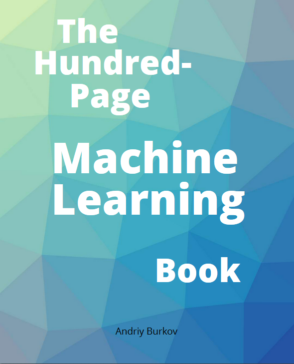

## ML_Book_100pg_zh
#《百页机器学习书》中文版的在线翻译

> 原书为英文版本：《[The Hundred-Page Machine Learning Book](http://themlbook.com/)》， by [Andriy Burkov](http://themlbook.com/wiki/doku.php)
> 欢迎参与和完善：为人类知识作出力所能及的奉献的同时个人也会收获满满。

## 原书目录：
### Preface
+ Chapter 1: Introduction
* Part I: Supervised Learning
+ Chapter 2: Notation and Definitions
+ Chapter 3: Fundamental Algorithms (plus in-depth material)
+ Chapter 4: Anatomy of a Learning Algorithm
+ Chapter 5: Basic Practice (plus in-depth material)
+ Chapter 6: Neural Networks and Deep Learning (plus in-depth material)
+ Chapter 7: Problems and Solutions
+ Chapter 8: Advanced Practice
* Part II: Unsupervised and Other Forms of Learning
+ Chapter 9: Unsupervised Learning (plus in-depth material)
+ Chapter 10: Other Forms of Learning
+ Chapter 11: Conclusion
* [Code on Github](https://github.com/aburkov/theMLbook)

## 中文目录如下：
+   零、前言
+   一、介绍
+   二、符号和定义
+   三、基本算法
+   四、线性算法剖析
+   五、最佳实践
+   六、神经网络和深度学习
+   七、问题和答案
+   八、高级实践
+   九、无监督学习
+   十、其它学习形式
+   十一、总结

## 贡献指南

项目当前处于翻译阶段，请查看[贡献指南](CONTRIBUTION.md)，并在QQ群或者[整体进度](issues)中领取任务。

> 请您勇敢地去翻译和改进翻译，我们不要求十全十美，不用担心翻译犯错，服务器的历史版本记录回溯可可随时挽回误操作。（改编自维基百科）

